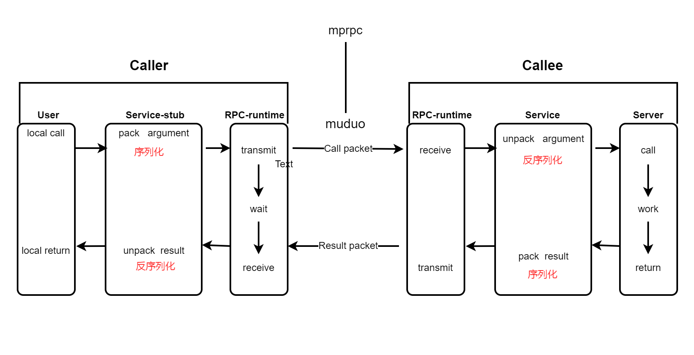

# mprpc分布式网络通信框架


## 简介

本项目实现了一个基于muduo网络库+Protobuf的分布式网络通信框架mprpc。传输层采用基于事件驱动和事件回调的epoll+线程池管理每一个TCP连接，也即muduo高性能网络库。

**项目开发由业务驱动框架开发**

Enjoy it，it's gonna be really fun!!!

## 项目环境

- OS: Ubuntu 20.04
- Complier: g++ 5.4.0
- Tools: CMake/VScode
- protobuf 3.0
- muduo

## 技术栈
* RPC远程过程调用原理以及实现
* Protobuf数据序列化和反序列化协议
* ZooKeeper分布式一致性协调服务应用以
* muduo网络库编程
* conf配置文件读取
* 异步日志
* CMake构建项目集成编译环境
* github管理项目

## 基础知识点

### 集群和分布式理论


#### 集群

* 单机服务器遇到的问题
```
1、受限于硬件限制资源，聊天服务器承受的用户并发量有限
2、任意模块的修改，都会导致整个项目代码重新编译、部署
3、系统中有些模块是cpu密集型的，有的属于I/O密集型，造成各个模块对于硬件资源的需求是不一样的（如果部署在同一服务器上，需要综合考量）
```

* 集群服务器

```
需要加一个负载均衡器。
优点：1用户并发量提升
缺点：2和3的问题还是没解决
也引入问题：后台管理这样的模块不需要高并发，但是使用集群时不得不全都部署
```
* 分布式服务和集群的区别

```
集群：每一台服务器独立运行一个工程的所有模块，多台服务器运行同一个服务，使用负载均衡分发
分布式：一个工程拆分成了许多模块，每个模块独立部署运行在一个服务器主机上。所有服务器协同工作共同提供服务，每一台服务器称作分布式的一个节点，根据每一个节点的并发要求，对一个节点可以做节点模块的集群部署。
```


#### 分布式
**优点**
```
解决问题l:可以对并发量需求高的模块，多部署几个（分布式节点的集群）
解决问题2:只需要对运行了出bug问题的分布式节点重新编译、部署
解决问题3:可根据各个模块的需求（CPU密集/I/O密集）选择不同类型的服务器
```

**缺点**
```
1、各模块如何划分？：软件工程的工作：需求分系、详细设计等等
2、各个模块间如何相互访问？（它们运行在不同的进程甚至不同的服务器）
    这就涉及到了进程间通信的效率以及可靠性了
```
**本项目主要时为了解决"问题2:模块间如何相互访问"开发分布式网络通信框架**

```
模块间通信：使用高性能muduo网络库
远程调用时方法参数识别、数据序列化和反序列化：Protobuf
如何找到方法：Zookeeper服务注册中心
```

### RPC通信原理和实现
```
RPC (Remote Procedure Call Protocol):远程过程调用协议

```
**一次rpc调用过程**


**stub**
```
设计rpc方法的打包与解析，即数据的序列化和反序列化，使用Protobuf
```
**RPC-runtime**
```
网络部分，包括寻找rpc服务主机，发起rpc调用请求，和响应rpc调用结果，使用muduo库和zookeeper服务配置中心（服务发现）
```
使用protobuf的理由：
1、protobuf二进制存储；xml，json都是文本存储的。
2、protobuf的序列化和反序列化速度快。


## 环境配置以及使用

### 项目目录
```shell
# 项目目录
tree
.
├── autobuild.sh # 自动编译脚本
├── bin # 可执行文件
├── build # 项目编译文件
├── CMakeLists.txt # 项目顶层cmake
├── example # 框架代码使用范例
├── img # 项目自述问件用到的图
├── lib # 项目编译成的库文件
├── README.md # 项目自述文件
├── src # 项目源码
└── test # 项目测试代码
```


### Protobuf
```
一种数据交换格式，独立于平台语言，效率高，用于分布式应用以及用于异构环境下的数据交换。

```

```shell
# 使用protoc,将.proto文件生成.cc .h文件,供程序调用
protoc test.proto --cpp_out=./

```

```proto
syntax = "proto3"; //声明版本

package fixbuf;//声明代码所在包，对c++来说是namespace

//定义下面的选项，生成service服务类和rpc方法描述，默认不生成
option cc_generic_services = true;

message ResultCode
{
    int32 errcode = 1;
    bytes errmsg = 2;
}


//数据  列表    映射表
//登录请求消息类型
message LoginRequest
{
    bytes name = 1;
    bytes pwd = 2;
}

//定义登录响应消息类型
message LoginResponse
{
    ResultCode result = 1;
    bool success = 2;
}

message GetFriendListsRequest
{
    uint32 userid = 1;

}

//定义用户
message User
{
    bytes name = 1;
    uint32 age = 2;
    enum Sex
    {
        MAN = 0;
        WOMAN = 1;
    }
    Sex sex = 3;
}

message GetFriendListsResponse
{
    ResultCode result = 1;
    //存储用户的列表类型
    repeated User friend_lists = 2;
}


//在protobuf中定义描述方法的类型-service

service UserServiceRpc
{
    rpc Login(LoginRequest)  returns(LoginResponse);
    rpc GetFriendLists(GetFriendListsRequest) returns(GetFriendListsResponse);
}

```

### message
```
message 定义的类对象，可以将参数以及返回值序列化和反序列换
//字符串可以用bytes来定义，因为protobuf底层就是用bytes,这样就不用转换了
```

```proto
message LoginRequest
{
    bytes name = 1;
    bytes pwd = 2;
}

message LoginResponse
{
    ResultCode result = 1;
    bool success = 2;
}
```

### service
```
service 定义的服务类和rpc方法，提供对rpc方法的定义和描述
```

```proto
service UserServiceRpc
{
    rpc Login(LoginRequest) returns(LoginResponse);
}

```
](img/service.png)


### 本地服务发布成rpc服务
```
1、定义.proto文件并生成c++代码
2、对要提供的服务，继承.proto中定义的service,并重写proto中定义的rpc方法
    在其中 解析请求request，用request中参数执行本地方法，将返回值填写到response，执行回调done->Run()它会使用框架发送结果给调用者
3、在main（）中需要执行3步：
    // 1、框架的初始化操作
    MprpcApplication::init(argc, argv);
    
    //2、使用框架发布服务:将UserService发布到rpc节点上
    RpcProvider provider;
    provider.notifyService(new UserService);
    // provider.notifyService(new OtherService);

    //3.启动一个rpc发布节点;run后，程序阻塞等待远程rpc调用请求
    provider.run();

```


###


## mprpc框架设计

### MprpcApplication.cc
* 读取配置文件
```shell
#rpc节点
rpcserverip=127.0.0.1
rpcserverport=8808

#zookeeper节点
zookeeperip=127.0.0.1
zookeeperport=8809
```

### RpcProvider.cc
####　建立服务器以及提供发布服务的notifyService
* 1、RpcProvider::run() 方法
读取配置参数（ip:port）：使用muduo网络库建立rpc服务节点，最后开启事件循环

* 2、RpcProvider::notifyService(::google::protobuf::Service *)
用户发布本地服务为rpc服务
```
所以它必须提供一个表，上面记录了每一个rpc服务对象发布了哪些方法
```
#### rpc服务分发
* 3、onConnection()&&&onMessage()
```
使用muduo网络库将网络收发数据与业务，分离，开发者只需有关注业务层
```

```

```

### MprpcChannel.cc

```
继承基类
class MprpcChannel : public ::google::protobuf::RpcChannel
并实现
MprpcChannel::CallMethod() override;

这样调用者

```
###
###
###


## Zookeeper分布式协调服务


## 问题

### 编译问题

```shell
# aux新增加文件后，不会将其加入到makefile中，需要cmake“清理所有项目的重新配置”
aux_source_directory(. SRC_LIST)
```

```
如果编译时依赖两个库A B，并且A库依赖B库

那么编译项目链接时的顺序:  -lA -lB
```

* 开发框架不能依赖具体的类
### 其他问题
